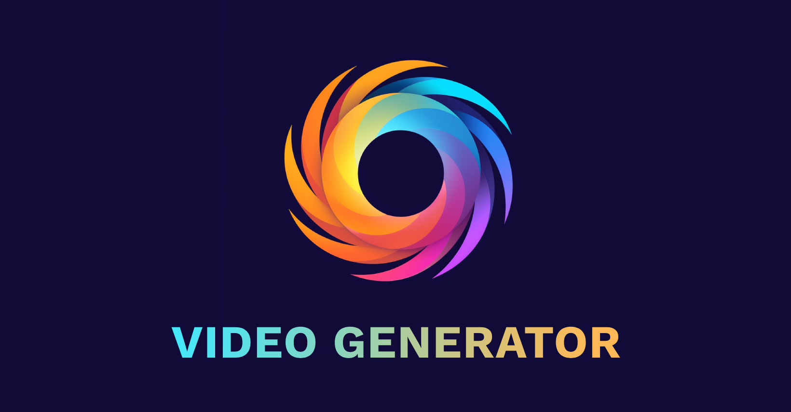

  

<h3 align="center">Video Generator</h3>

  

    Generate motivational videos with AI.
  

## About The Project

Backend service that generates motivational videos using AI technology. It combines ChatGPT quote generation with text-to-speech and video creation tools to produce dynamic content, emailing a download link to the result - all running on serverless architecture in AWS.

### Built With

[![TypeScript][ts-shield]][ts-url]

[![AWS][aws-shield]][aws-url]

[![SST][sst-shield]][sst-url]

[![React][react-shield]][react-url]

[![Remotion][remotion-shield]][remotion-url]

## Roadmap

- [ ] Invoke video generation with randomised input on a schedule.
- [ ] Add architecture diagrams to README.

## Contact

[![LinkedIn][linkedin-shield]][linkedin-url]

Project Link: [https://github.com/ghtaylor/video-generator](https://github.com/ghtaylor/video-generator)

[linkedin-shield]: https://img.shields.io/badge/LinkedIn-272D2D.svg?style=for-the-badge&logo=linkedin
[linkedin-url]: https://linkedin.com/in/george-taylor-71394b138
[react-shield]: https://img.shields.io/badge/React-272D2D?style=for-the-badge&logo=react&logoColor=61DAFB
[react-url]: https://reactjs.org/
[ts-shield]: https://img.shields.io/badge/TypeScript-272D2D.svg?style=for-the-badge&logo=typescript
[ts-url]: https://typescriptlang.org/
[aws-shield]: https://img.shields.io/badge/AWS-272D2D.svg?style=for-the-badge&logo=amazon-aws&logoColor=FF9900
[aws-url]: https://aws.amazon.com/
[sst-shield]: https://img.shields.io/badge/SST-272D2D.svg?style=for-the-badge&logo=sst
[sst-url]: https://sst.dev/
[remotion-shield]: https://img.shields.io/badge/Remotion-272D2D.svg?style=for-the-badge
[remotion-url]: https://remotion.dev/
